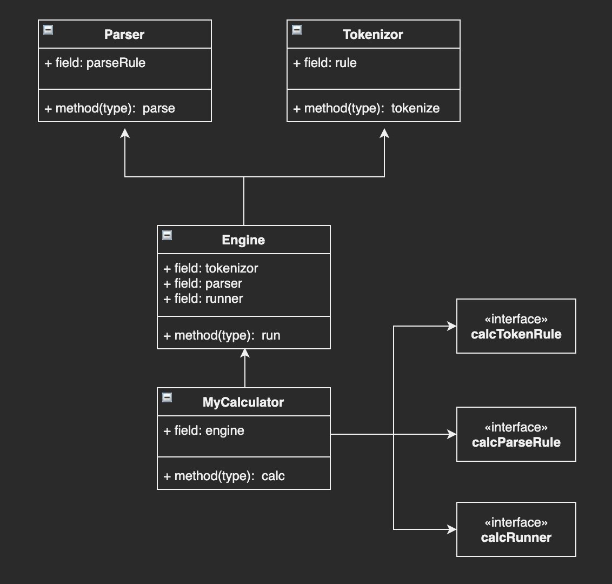

## How to start
```
npm start
```
查看测试用例
## 思路
将入参先分词，再根据一定规则生成AST，生成后遍历计算结果。
以```1 + 2 / 2 * 3 + 2```为例，需要先确定抽象语法树，如下
```js
{
  operator: '+',
  left: {
    operator: '+',
    left: {
      value: 1
    },
    right: {
      operator: '*',
      left: {
        operator: '/',
        left: {
          value: '2'
        },
        right: {
          value: '2'
        }
      },
      right: {
        value: 3
      }
    }
  },
  right: {
    value: 2
  }
}
确定了AST后，主要需要解决的问题有
* 分词，得到tokens
* 通过什么算法将str生成抽象语法树
* 语法树遍历计算结果
```
### 整体依赖关系
Engine做分词、parse并执行run，整体依赖关系如下图。Engine类做控制，接收options，决定每个步骤如何处理。不依赖calc具体实现，做依赖反转，与具体业务逻辑解耦。

### 算法
从上面节点分析，整个树上的节点，越往下优先级越高。所以需要记录last operator以便比较优先级
遇到运算符需要判断优先级
* 优先级更高
  * 在last opr节点处下沉
* 优先级一致
  * 在last opr上浮一层（因为计算更晚）（上浮需要处理parent节点，所以节点下沉时需要记录一下parent）
* 优先级更低
  * 需要找到最近的，比当前运算符优先级低一级的指针，再上浮一层
## 说明
1. 如果直接解决该问题，通过算法转成后缀表达式（逆波兰）再计算应该也可以得到结果。
2. 实现时，对于优先级更低场景，考虑到加减乘除只有两个优先级，做了简单处理，如果要扩展优先级的话，算法还需要改进
## todo
1. 支持括号语法
## Refs
1. https://astexplorer.net/
2. https://github.com/acornjs/acorn